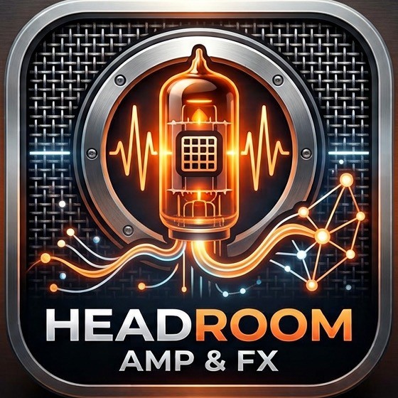
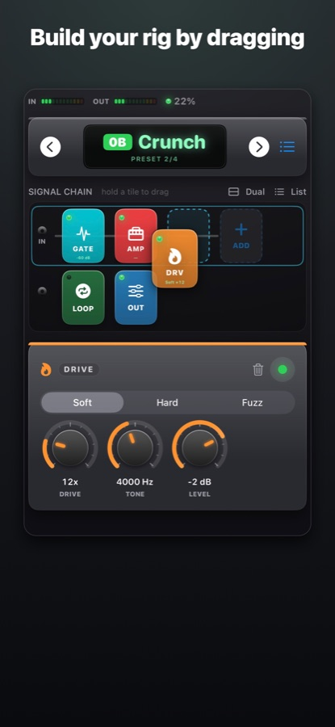
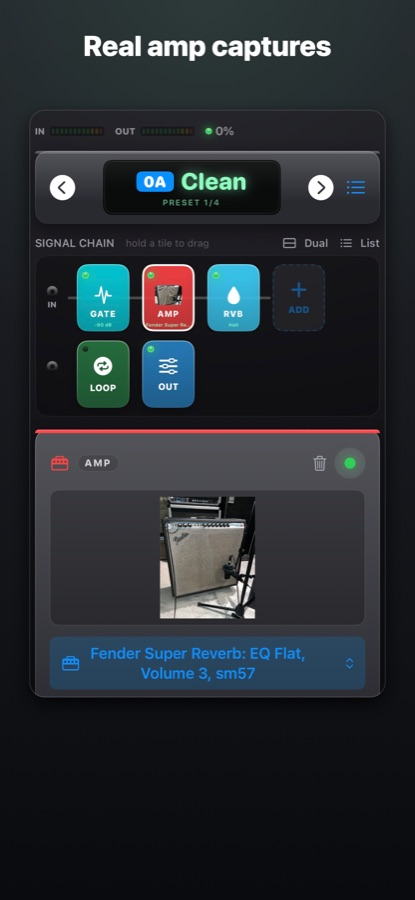
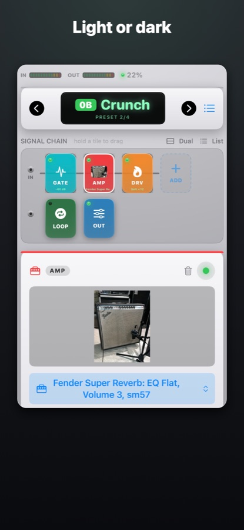
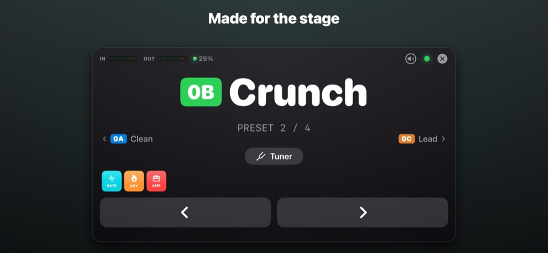
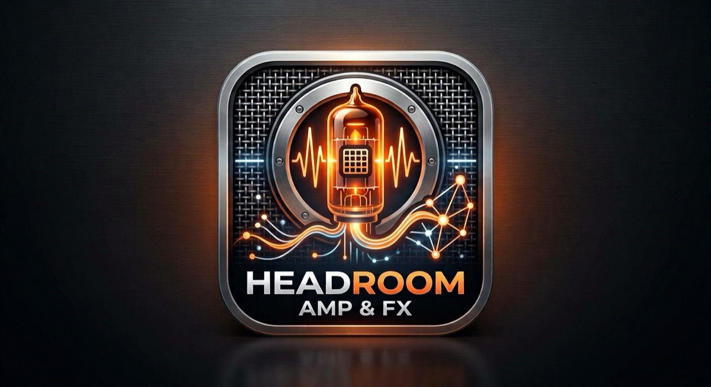

<p align="center">
  
</p>

<h1 align="center">Headroom — Amp &amp; FX</h1>

<p align="center">
  A native iOS + macOS guitar rig built on <a href="https://www.neuralampmodeler.com">Neural Amp Modeler</a> captures.<br/>
  Two drag-and-drop signal paths, real effects, MIDI in/out, TONE3000 built in. Free, no subscription, open source.
</p>

<p align="center">
  
  
  
  
</p>

<p align="center">
  
  
  
</p>
<p align="center">
  
</p>

## Why Headroom

The amp core is NAM — the same capture technology behind today's flagship modelers, with thousands of
free amp and pedal captures from the community. Around it, Headroom adds what a modeler needs on stage:
a rig you build by dragging, effects that sound right, presets, MIDI, and a Live view — without a
subscription, an account, ads, or tracking.

## Features

- **Amp core: NAM.** Loads any `.nam` capture (WaveNet A1/A2, LSTM, custom). Level-matches from the
  capture's loudness metadata, rumble-filters the input, and caps makeup gain so quiet captures don't
  become hiss. A second NAM slot takes pedal captures in front of the amp.
- **Two complete signal paths (A ∥ B)** with per-path level and pan into a stereo output. Any block
  can appear any number of times — two delays, EQ before *and* after the amp, two amps. Drag tiles to
  reorder or move them between paths; a block keeps its settings wherever it goes.
- **Blocks:** noise gate (hysteresis / hold / range), soft-knee compressor, clean boost, anti-aliased
  oversampled drive, circuit-modeled stompbox overdrives and fuzz, wah (expression pedal or auto), cab
  IR, 3-band EQ, chorus, flanger, tremolo, tape-style delay (tempo sync, tap), room / plate / spring /
  hall reverbs, convolution reverb, stereo widen stage, phrase looper.
- **MIDI:** Program Change → preset, CC/note mappings with learn, expression pedal, momentary or
  latching switches, Bank Select, MIDI clock in → tempo; **MIDI out** (PC on preset load, per-preset
  send list, CC feedback, clock); Bluetooth MIDI pairing on iOS.
- **TONE3000:** sign in, browse Trending / Favorites / Mine / Downloaded, search with sort and filters,
  favorite tones, one-tap download of captures and cab IRs.
- **Live view** for the stage; setlist management; presets migrate across schema changes.

## Install

- **App Store:** Headroom — Amp & FX (free). Link coming when review completes.
- **Build it yourself:** see below. Requires Xcode 26, iOS 18+ or macOS 15+.

## Building

```
git clone --recurse-submodules https://github.com/AvrahamOhana/headroom.git
open headroom/NamRig/NamRig.xcodeproj
```

The NAM core is a git submodule (`ThirdParty/NeuralAmpModelerCore`, which nests Eigen and
nlohmann/json) — clone with `--recurse-submodules` or run `git submodule update --init --recursive`.

Set your own team in Signing & Capabilities, pick the `NamRig` scheme, and run on **My Mac** or an
iPhone (the iOS Simulator cannot do real-time guitar audio). Command line:

```
# macOS
xcodebuild build -project NamRig/NamRig.xcodeproj -scheme NamRig -destination 'platform=macOS' -quiet
# iOS (compile check, no signing)
xcodebuild build -project NamRig/NamRig.xcodeproj -scheme NamRig -destination 'generic/platform=iOS' CODE_SIGNING_ALLOWED=NO -quiet
# iOS deploy to a paired device
DEV=<device-id from `xcrun devicectl list devices`> tools/deploy.sh
```

Debug builds keep the C++ and Swift optimizers on (`GCC_OPTIMIZATION_LEVEL=2`, `-O`): the neural
network is ~40× slower unoptimized and the audio thread starves.

## Testing without a device

- `tools/blocks_test.swift` — compiles the real DSP blocks and checks them numerically (gate, compressor,
  delay, chorus, flanger, amp block, wah, lock-free chain). Run command in the file header.
- `tools/preset_test.swift` — preset schema round-trip and migration of old presets.
- `tools/render.sh <model.nam> <in.wav> <out.wav>` — renders audio through the real NAM core + blocks
  offline and prints peak / noise floor / click metrics.

The Xcode project, source folder and Swift module keep the working title `NamRig`. `HANDOFF.md` is the
developer guide: architecture, gotchas, and the roadmap.

## Captures

Headroom ships one capture, the author's own amp (CC BY 4.0). Bring your own `.nam` files, or log in to
TONE3000 inside the app. Never redistribute captures you downloaded — they belong to their creators.

## Contributing

Issues and pull requests are welcome. Good first areas: new block types (`Blocks.swift` — one class,
`prepare / process / reset`, RT-safe), UI polish, and translations.

## License

GPL-3.0-or-later — see `LICENSE`. Third-party notices and the capture license are in `NOTICE.md`.
Headroom is not affiliated with Neural Amp Modeler, TONE3000, or any amplifier or pedal manufacturer.

<p align="center"></p>
